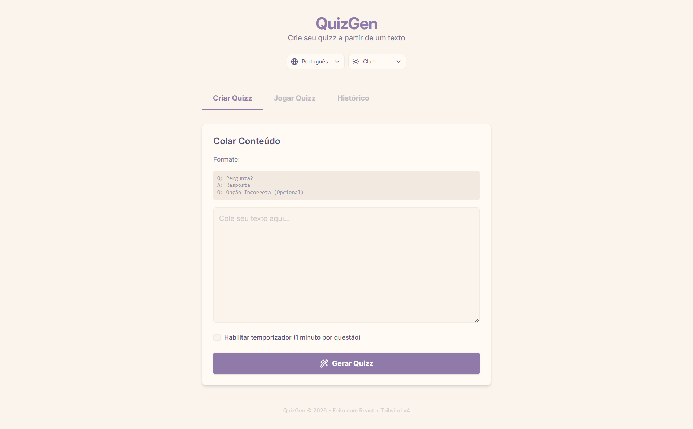
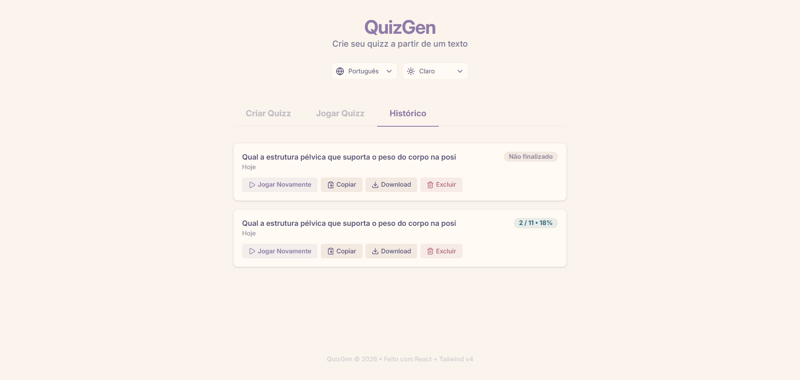
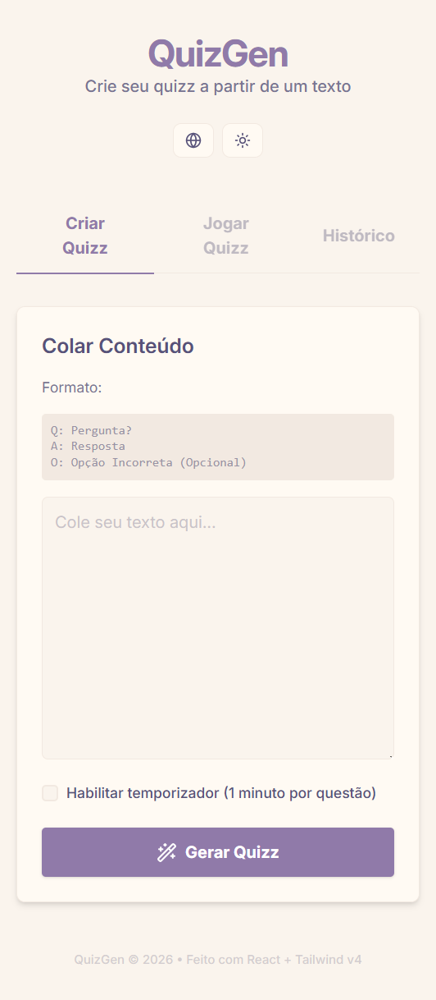
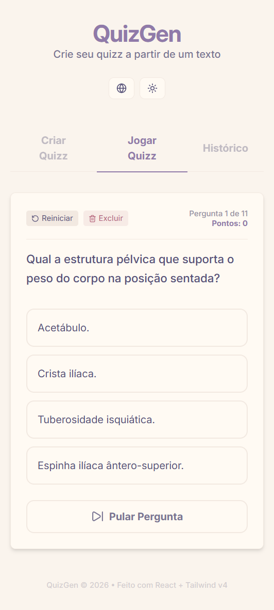
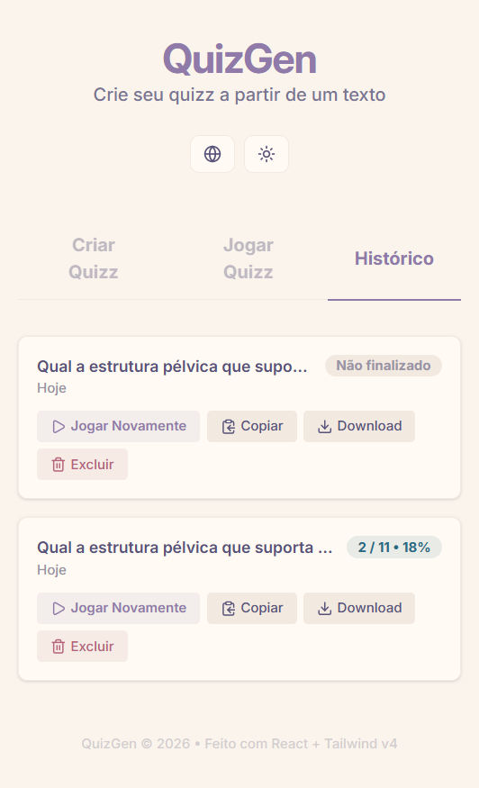

# Boron

Create quizzes and flashcards from text. Built with React 19, TypeScript, Tailwind CSS v4, and Vite.

🔗 **Live Demo:** [https://ikidon.github.io/boron/](https://ikidon.github.io/boron/)

---

## Features

* ✨ **Quiz Generation** — paste text in `Q: Question? / A: Correct Answer / O: Incorrect Option` format
* 🎮 **Play Mode** — answer questions with instant feedback and optional per-question timer
* 📊 **Results Summary** — track correct, incorrect, and skipped answers
* 🕒 **History** — generated quizzes are automatically saved to localStorage (up to 20 entries)

  * Replay previous quizzes
  * Copy quiz content to clipboard
  * Download quiz as `.txt`
* 🎨 **Theme Support** — Light, Dark, and Auto (system preference)
* 🌐 **Internationalization (i18n)** — English and Brazilian Portuguese
* 📱 **Responsive Design** — optimized for desktop and mobile devices
* ⚡ **Fast & Lightweight** — no external state management or i18n libraries

---

## Screenshots

### Desktop

<picture></picture>
<picture></picture>
<picture></picture>

### Mobile

<picture></picture>
<picture></picture>
<picture></picture>

---

## Example Input

```text
Q: What is the capital of Brazil?
A: Brasília
O: Rio de Janeiro
O: São Paulo
O: Salvador

Q: Which language is primarily used with React?
A: JavaScript
O: Python
O: Java
O: C#
```

---

## How It Works

1. Write your questions using the `Q/A/O` format.
2. Generate the quiz.
3. Answer each question.
4. Review your score and performance.
5. Access previous quizzes from the History tab.

---

## Tech Stack

* React 19
* TypeScript
* Tailwind CSS v4
* Vite
* Biome (linting and formatting)
* Lucide React (icons)

### Design Principles

* No external state management libraries
* No external i18n packages
* No UI component libraries
* Mobile-first responsive design
* Local-first persistence using localStorage

---

## Getting Started

### Prerequisites

* Node.js 20+
* npm

### Installation

```bash
npm install
```

### Development

```bash
npm run dev
```

Open:

```text
http://localhost:5173
```

---

## Available Scripts

| Command           | Description                            |
| ----------------- | -------------------------------------- |
| `npm run dev`     | Start Vite development server          |
| `npm run build`   | Type-check and create production build |
| `npm run preview` | Preview production build locally       |
| `npm run lint`    | Run Biome lint                         |
| `npm run format`  | Format code with Biome                 |

---

## Project Structure

```text
src/
├── components/     # UI components
├── hooks/          # Custom hooks
├── i18n/           # Internationalization provider
├── locales/        # Translation files
├── types/          # TypeScript types
├── utils/          # Utility functions
└── app.tsx         # Root application component
```

## Roadmap

Potential future improvements:

* Import/export quizzes as JSON
* Additional quiz formats
* More languages
* Quiz sharing through URLs
* Progress statistics and analytics

---

## License

This project is licensed under the MIT License.

---

## Author

Developed by **João Antonio (Ikidon)**

GitHub: https://github.com/ikidoncc
